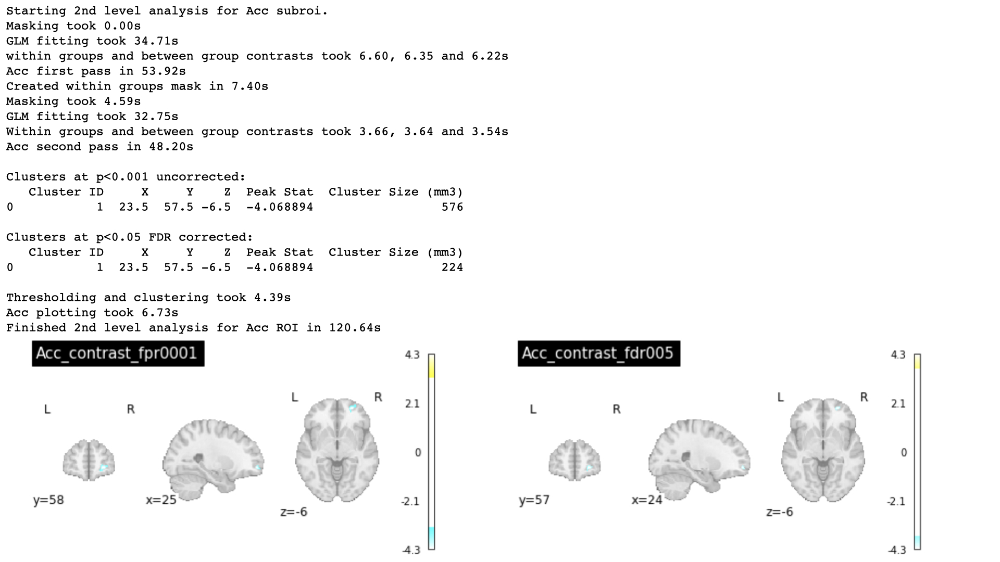
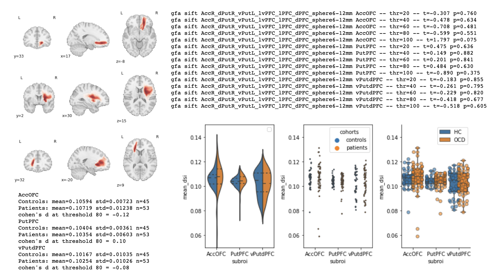
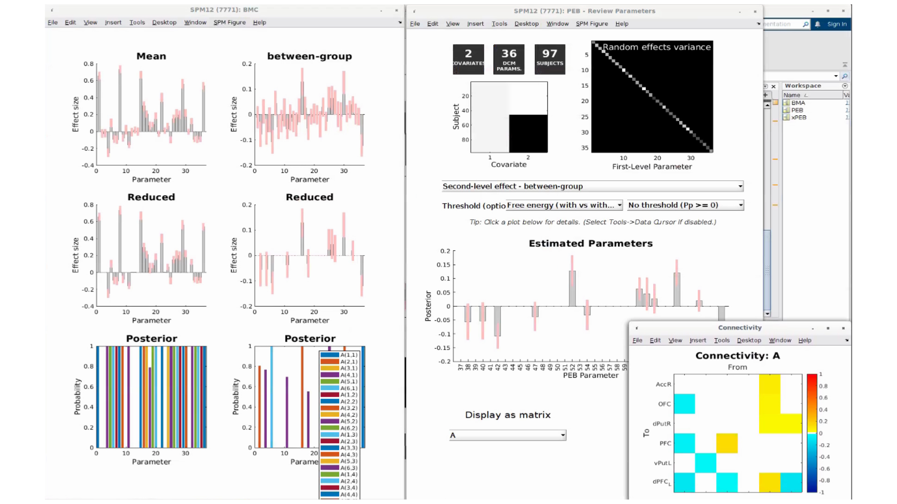

Baseline OCD Neuroimaging
=========================================
Structural and Functional Neuroimaging analysis of OCD baseline data.

[Check our paper published in Brain](https://academic.oup.com/brain/advance-article-abstract/doi/10.1093/brain/awac425/6830574)

<!-- dependencies: pybct, h5py, nibabel, nilearn, pandas, scipy, sklearn, statsmodel.
     insert badges instead -->

Table of contents
-----------------
* [Installation](#installation)
* [Usage](#usage)
  - [Workflow](#workflow)
    + [Functional analysis](#functional-analysis)
    + [Structural analysis](#structural-analysis)
    + [Effective connectivity](#effective-connectivity)
  - [Code structure](#code-structure)
    + [Main modules](#main-modules)
    + [Old (deprecated) modules](#old-deprecated-modules)
    + [Utility](#utility)
* [License](#license)
* [Authors and history](#authors-and-history)
* [Acknowledgments](#acknowledgments)

Installation
------------
> Tested on Ubuntu 20.04
> Linux-5.8.0

It is strongly advised to install the project into a new virtual environment using python 3.9:

    pyenv install 3.9.7 OCDenv
    pyenv activate OCDenv

Then from the root of this source repository (where the `setup.py` is located), type

    pip install -e .

Usage
-----

[Workflow](#workflow) provides an overall walkthrough of each of the 3 analysis ([functional](#functional-analysis), [structural](#structural-analysis) and [effective](#effective-analysis)) to reproduce the results of the study.

[Code structure](#code-structure) provides a more specific description of each module.

For more details about each module, refer to each file separately.

## Workflow

This project contains 3 "*streams*" of analysis: functional, structural, and effective connectivity analysis.
> _n.b. technically the effective connectivity analysis is also functional_

### Functional analysis
> The functional analysis assumes that [fMRIPrep](https://github.com/nipreps/fmriprep) has already been run. Before running the following scripts, ensure that the path to the project directory `proj_dir` is correctly set in those scripts and that the output folder `derivatives` has been generated from fMRIPrep with its adequate content.

To perform several preprocessing steps (denoising, filtering, global signal regression, scrubbing, etc.), and the first-level SPM analysis; from the HPC cluster run the following PBS script

    functional/prep_spm_dcm.pbs

This calls `preprocessing/post_fmriprep_denoising.py` with a set of default preprocessing parameters. See this file for more details about the preprocessing pipeline and the [fmripop](https://github.com/brain-modelling-group/fmripop) package.

The second-level SPM analysis is performed by running the following command:

    python functional/seed_to_voxel_analysis.py --min_time_after_scrubbing 2 --plot_figs --run_second_level --brain_smoothing_fwhm 8 --fdr_threshold 0.05 --save_outputs

Here, the arguments indicate to discard subjects with less than 2 minutes of data after scrubbing was performed, use the 8mm spatially smoothed data (need to be preprocessed accordingly above) and to use a FDR corrected p-value threshold of 0.05.

The output of the script should look like this (only shown for one pathway):

To run the analysis using FSL randomise, the argurments are different:

    python functional/seed_to_voxel_analysis.py --min_time_after_scrubbing 2 --brain_smoothing_fwhm 8  --use_randomise  --n_perm 5000 --use_TFCE --group_by_hemi --use_frontal_mask

This run the analysis using 5000 permutations and the frontal masks described in the paper (Supplementary Materials). 

### Structural analysis

The structural connectivity analysis starts by running the [QSIPrep](https://github.com/PennLINC/qsiprep) pipeline to preprocess DWI and perform tractography.
This is performed in the HPC cluster through the following script:

    structural/qsiprep_parallel_combined.pbs

The parameters used for DWI preprocessing and the tractography algorithm can be found in `preprocessing/qsiprep_recon_file_100M_seeds.json`.

For each subject, this creates 100 millions streamlines and connectivity matrices following some established atlases. However, we now want to focus on the structural connectivity between the volumes of interests (cluster or seed VOIs) involved in the functional analysis. This implies creating a new parcellation (or brain atlas) from those VOIs.
> Currently such atlas is created manually by calling `voxelwise_diffusion_analysis.create_atlas_from_VOIs()` from an interactive python console or jupyter notebook

and generating a connectivity matrix from this new atlas:

    structural/create_connectome_from_atlas.pbs

Then from a local workstation, we can create the track density maps for each individuals

    structural/create_track_density_maps.sh

and finally run the voxel-wise analysis that extract the GFA using specific pathway mask based on track density:

    structural/voxelwise_diffusion_analysis.py --compute_tdi --plot_tdi_distrib --plot_figs

The output of the script should look like this:

### Effective connectivity analysis

> The effective connectivity analysis uses DCM, which is part of SPM12 bundle and runs on MATLAB. It is located in the `dcm` folder.

The first step is to perform the first level SPM analysis, which is scripted in an SPM matlabbatch, from matlab command-line, runs

    dcm/spm_first_level_matlabbatch.m

Given that the volumes of interests (VOIs) have been extracted from the functional analysis above, this creates a `SPM.mat` file for each subject and extracts the time series of each VOI in a separate `VOI_XXX_1.mat` where XXX is the VOI name.
Any additional VOI can added and its time series extracted using the following script:

    dcm/spm_loop_local_cluster_matlabbatch.m

Once this is done, we can estimate the model. We here use a monostable bilinear stochastic model, and fit it to the BOLD signal using spectral DCM. It is performed in he following script:

     dcm/dcm_specify_estimate_AccOFC_PutPFC_vPutdPFC.m

Finally, we create a large number of models spanning several connectivity profiles using Parametric Empirical Bayes (PEB).

    dcm/peb_second_level_redesigned.m

This effectively probes which connectivity changes are most likely to induce the effects observed between are two groups (controls vs patients), using Bayesian Model Averaging. The results are exposed through the matlab GUI.

The PEB review window showing the results should look like this:

## Code structure

This is a quick description of each module, for more details, refers to the docstrings within each file.

> Note: each *_analysis.py script can be run individually with a set of default parameters.

### Main modules

&ensp;&ensp;&ensp;&ensp; **functional/seed_to_voxel_analysis.py**: Main script for the functional analysis. It prepare files for SPM and also performs _first_ and _second_ level analysis in nilearn. The _second level_ routine is performed in 2 phases: 1) extract within-group masks and join them to create _first-level_ mask; 2) re-do _second-level_ using this _first level_ mask. It displays cluster table statistics and color-coded brain maps of difference between groups.

&ensp;&ensp;&ensp;&ensp; **structural/voxelwise_diffusion_analysis.py**: Main script for the structural analysis. It extracts masks of high track density voxels for each pathway of interest and each subject, and computes the average generalized fractional anisotropy (GFA) within these masks. It displays violin, strip and box plots of the distribution of GFA for patients and controls in each pathway.

  &ensp;&ensp;&ensp;&ensp; **ybocs_analysis.py**: Script for assessing the association of functional, structural and effective connectivity measures to clinical severity scores.

### Old (deprecated) modules

&ensp;&ensp;&ensp;&ensp; **old/qsiprep_analysis.py:** Analysis of structural connectivity matrices, resulting from running QSIPrep. Most of this module was written in an earlier part of the project when analysis structural connectomes, but it includes several functions that are used in other modules.

### Utilities

&ensp;&ensp;&ensp;&ensp; **utils/atlas_extraction.py:** Create FC matrices from preprocessed BOLD signals and brain atlases.

&ensp;&ensp;&ensp;&ensp; **utils/atlaser.py:** Utility module for handling atlases, ROI indexing, create subatlases, etc.

Licence
-------

This work is licensed under a Creative Commons Attribution 4.0 International License.

Authors and history
-------------------

This code was contributed by Sebastien Naze for QIMR Berghofer in 2021-2022.

Acknowledgments
---------------

NHMRC grant number 2001283
